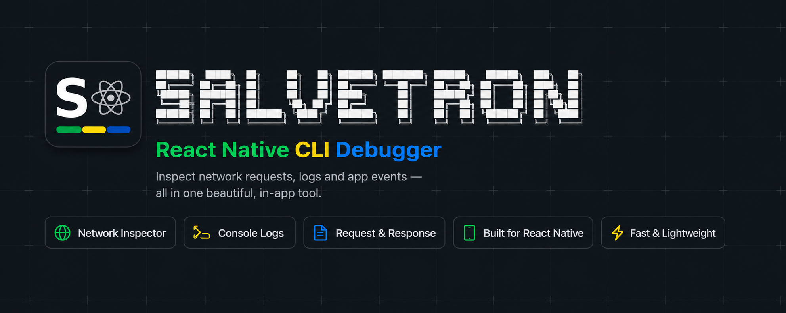

<p align="center">
  
</p>

<h1 align="center">Mako</h1>

<p align="center">
  <strong>Real-time terminal UI debugger for React Native</strong>
</p>

<p align="center">
  
  
  
</p>

---

Mako is a real-time debugging tool for React Native developers, delivered as a terminal UI (TUI). The Mako CLI runs a WebSocket server in your terminal and renders incoming telemetry — JS logs, native logs, network traffic, and live performance metrics — from your running app. Your app streams that telemetry using the companion SDK, `@salve-software/mako-react-native`.

## Features

- **Dashboard** - Live performance overview: UI/JS FPS, memory and CPU usage, with sparkline history
- **JS Logs** - Stream JavaScript console logs with level filtering (debug, info, warn, error) and an expandable detail panel for metadata
- **Network Inspector** - Inspect HTTP requests and responses: method, status, duration, headers, and pretty-printed bodies
- **Native Logs** - View iOS and Android platform logs in real-time, with source tags
- **Keyboard-driven TUI** - Navigate panels and lists entirely from the keyboard; no GUI required
- **Zero-config WebSocket server** - Starts on port 8765 by default (override with `MAKO_PORT`)

## Screenshots

<!-- Add your screenshots here -->

<p align="center">
  <em>Screenshots coming soon...</em>
</p>

<!--
Example:
<p align="center">
  
</p>
-->

## Architecture

Mako has two parts:

```
┌──────────────────────────┐        WebSocket          ┌──────────────────────────┐
│     React Native App      │ ───────────────────────▶ │        Mako CLI          │
│ @salve-software/          │        port 8765          │  (terminal UI debugger)  │
│   mako-react-native (SDK) │                           │                          │
└──────────────────────────┘                            └──────────────────────────┘
         │                                                        │
         ├── JS Console Logs                                      ├── Dashboard (FPS/CPU/memory)
         ├── Native Logs (iOS/Android)                            ├── JS Logs viewer
         ├── Network Requests/Responses                           ├── Network Inspector
         └── Performance Metrics                                  └── Native Logs viewer
```

1. **Mako CLI** (`@salve-software/mako-cli`): an Ink-based terminal UI that runs a WebSocket server and renders telemetry from connected apps.

2. **mako-react-native** (SDK): A React Native package built with Nitro Modules that captures logs, network activity, and performance metrics and streams them to the CLI.

## Installation

### Requirements

| Component | Requirement |
|-----------|-------------|
| Mako CLI | Node.js 18+ |
| React Native SDK | React Native 0.73+ |
| Xcode | 15+ (for iOS development) |
| Android Studio | Latest (for Android development) |

### Running the Mako CLI

1. Clone the repository:
   ```bash
   git clone https://github.com/Gabriel-Pereira1788/mako.git
   cd mako
   yarn install
   ```

2. Start the CLI:
   ```bash
   yarn dev          # starts the Mako CLI (Ink TUI) on port 8765
   ```

   Or, once linked as a bin:
   ```bash
   mako
   ```

   Override the port with the `MAKO_PORT` environment variable:
   ```bash
   MAKO_PORT=9000 yarn dev
   ```

### Installing React Native SDK

1. Install the package in your React Native project:

   ```bash
   # Using npm
   npm install @salve-software/mako-react-native

   # Using yarn
   yarn add @salve-software/mako-react-native
   ```

2. For iOS, install pods:
   ```bash
   cd ios && pod install && cd ..
   ```

3. For Android, the package will auto-link. Run a gradle sync if needed.

## Usage

### Starting the Mako CLI

Run `yarn dev` (or `mako`) in your terminal. The CLI starts a WebSocket server on port **8765** and shows the Dashboard. Use the tab bar / keyboard shortcuts shown in the status bar to switch between Dashboard, JS Logs, Network, and Native Logs. Connected device info appears in the header once your app connects.

### Connecting from React Native

Add the following code to your React Native app's entry point (e.g., `App.tsx` or `index.js`):

```typescript
import { Mako } from '@salve-software/mako-react-native';

// Connect only in development mode
if (__DEV__) {
  Mako.connect({
    host: '192.168.1.100', // Your Mac's IP address
    port: 8765,
    enableNetworkCapture: true,
    onConnect: () => console.log('Connected to Mako!'),
    onDisconnect: () => console.log('Disconnected from Mako'),
    onError: (error) => console.error('Mako error:', error),
  });
}
```

> **Tip**: Use `localhost` when running on iOS Simulator, or your Mac's local IP address for physical devices.

### API Reference

#### `Mako.connect(config?)`

Establishes a WebSocket connection to the Mako CLI.

```typescript
interface MakoConfig {
  host?: string;              // Default: 'localhost'
  port?: number;              // Default: 8765
  enableNetworkCapture?: boolean;  // Default: true
  ignoredUrls?: RegExp[];     // URL patterns to ignore
  onConnect?: () => void;
  onDisconnect?: () => void;
  onError?: (error: Error) => void;
}
```

#### `Mako.disconnect()`

Closes the WebSocket connection.

```typescript
Mako.disconnect();
```

#### `Mako.isConnected()`

Returns the current connection status.

```typescript
const connected = Mako.isConnected(); // boolean
```

#### Logging Methods

```typescript
// Send logs with different levels
Mako.log('General log message');
Mako.debug('Debug information', { userId: 123 });
Mako.info('Informational message');
Mako.warn('Warning message');
Mako.error('Error message', { stack: error.stack });
```

All logging methods accept an optional metadata object as the second parameter.

## Troubleshooting

### Connection Issues

**Problem**: App can't connect to the Mako CLI

**Solutions**:
1. Ensure the Mako CLI is running (`yarn dev` / `mako`)
2. Check that both devices are on the same network
3. Verify the IP address is correct (use `ifconfig` to find your machine's IP)
4. Check if port 8765 is not blocked by firewall
5. For iOS Simulator, use `localhost` instead of IP address

### Network Requests Not Showing

**Problem**: HTTP requests are not appearing in the Network tab

**Solutions**:
1. Ensure `enableNetworkCapture: true` is set in the config
2. Check if the URL isn't in the `ignoredUrls` list
3. Default ignored URLs include Metro bundler (port 8081) and hot reload endpoints

### Logs Not Appearing

**Problem**: Console logs are not showing in the Mako CLI

**Solutions**:
1. Verify the connection is established (`Mako.isConnected()`)
2. Ensure you're running in development mode (`__DEV__ === true`)
3. Confirm the CLI shows your device in the header

### High Memory Usage

**Problem**: The Mako CLI process using too much memory

**Solutions**:
1. Clear logs periodically from the JS Logs / Native Logs panels
2. Reduce the number of connected devices
3. Filter out verbose logs at the source

## Contributing

We welcome contributions! Here's how you can help:

### Getting Started

1. Fork the repository
2. Clone your fork:
   ```bash
   git clone https://github.com/your-username/mako.git
   ```
3. Create a new branch:
   ```bash
   git checkout -b feature/your-feature-name
   ```

### Branch Naming Convention

- `feature/` - New features
- `fix/` - Bug fixes
- `docs/` - Documentation updates
- `refactor/` - Code refactoring
- `test/` - Adding or updating tests

### Commit Message Format

Follow conventional commits:
```
type(scope): description

Examples:
feat(sdk): add custom log levels support
fix(app): resolve memory leak in log viewer
docs(readme): update installation instructions
```

### Pull Request Process

1. Ensure your code follows the existing style
2. Update documentation if needed
3. Test your changes thoroughly:
   - For Mako CLI: run `yarn dev` and verify with the simulator (`yarn sim`)
   - For SDK: Test with the example app
4. Create a Pull Request with a clear description

### Code Style Guidelines

**mako-cli (TypeScript / Ink)**:
- Use TypeScript for all source files
- Keep modules organized under `src/modules/<feature>` and shared UI under `src/shared`
- Run `yarn typecheck` before opening a PR

**mako-react-native (TypeScript)**:
- Use TypeScript for all source files
- Follow existing patterns in the codebase
- Document public APIs with JSDoc comments

### Running the Example App

```bash
cd mako-react-native/example
yarn install
cd ios && pod install && cd ..
yarn ios  # or yarn android
```

## License

This project is licensed under the MIT License - see below for details:

```
MIT License

Copyright (c) 2024 Mako Contributors

Permission is hereby granted, free of charge, to any person obtaining a copy
of this software and associated documentation files (the "Software"), to deal
in the Software without restriction, including without limitation the rights
to use, copy, modify, merge, publish, distribute, sublicense, and/or sell
copies of the Software, and to permit persons to whom the Software is
furnished to do so, subject to the following conditions:

The above copyright notice and this permission notice shall be included in all
copies or substantial portions of the Software.

THE SOFTWARE IS PROVIDED "AS IS", WITHOUT WARRANTY OF ANY KIND, EXPRESS OR
IMPLIED, INCLUDING BUT NOT LIMITED TO THE WARRANTIES OF MERCHANTABILITY,
FITNESS FOR A PARTICULAR PURPOSE AND NONINFRINGEMENT. IN NO EVENT SHALL THE
AUTHORS OR COPYRIGHT HOLDERS BE LIABLE FOR ANY CLAIM, DAMAGES OR OTHER
LIABILITY, WHETHER IN AN ACTION OF CONTRACT, TORT OR OTHERWISE, ARISING FROM,
OUT OF OR IN CONNECTION WITH THE SOFTWARE OR THE USE OR OTHER DEALINGS IN THE
SOFTWARE.
```

---

<p align="center">
  Made by Salve Software
</p>
